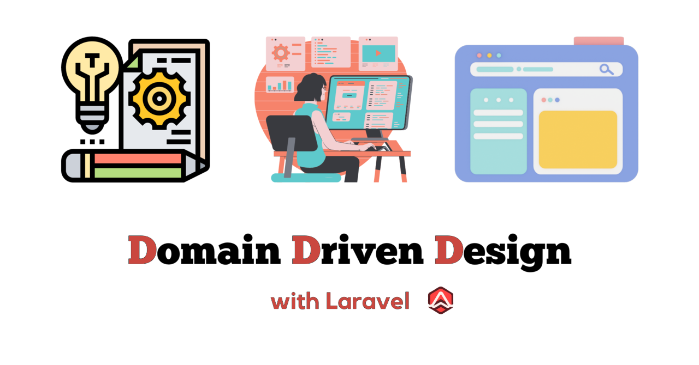

# DDD-Template

DDD-Template is a ready-to-use Laravel template designed to facilitate the development of web applications using Domain-Driven Design principles. This template streamlines the process of building robust and scalable applications, ensuring a solid architectural foundation for your project.

## ✨ Key Features

- **Laravel Framework:** Leveraging the power and simplicity of Laravel.

- **Domain-Driven Design:** Incorporates DDD principles for effective complex domain modeling.

- **Scalability and Maintainability:** Structured to support large-scale applications and ease of maintenance.

## 🧙 Who is This Template For?
This Domain-Driven Design (DDD) template for Laravel is designed for developers and teams who seek to:

- **_Embrace Domain-Driven Design_**: Ideal for those looking to implement DDD principles in their Laravel projects, facilitating a deep connection between the software and the underlying business concepts.
- **_Build Large and Complex Applications_**: Particularly beneficial for large-scale applications where separating business logic from application and infrastructure code is crucial for maintainability and scalability.
- **_Improve Code Organization_**: Suitable for developers who aim to enhance code structure, making it more readable, maintainable, and easier to navigate.
- **_Facilitate Team Collaboration_**: A great fit for teams that require a clear and consistent coding structure, enabling easier collaboration, especially in larger or distributed teams.
- **_Focus on Business Logic_**: For developers who want to concentrate on implementing business rules and logic without being entangled in framework-specific details.
- **_Ensure High-Quality Code_**: Beneficial for those who prioritize testing and want a structured approach to both unit and integration testing.
- **_Adopt Advanced Laravel Practices_**: Suitable for experienced Laravel developers looking to adopt advanced practices and architectural patterns in their projects.

Whether you are a solo developer, part of a small team, or involved in a large enterprise project, this template offers a structured approach to implementing DDD in Laravel, aligning technical implementation with business requirements, and ensuring long-term project success and maintainability.

## 🧬 Project Structure

The project is organized into three primary layers, each residing in its own subfolder within the "[app/](./app)" folder :

1. **Application Layer**
   - **_Location_**: [Application/](./app/Application)
   - **_Purpose_**: This layer contains all the application logic and acts as a bridge between the domain and the infrastructure layers. It includes controllers, services, and other mechanisms that drive the application flow.
   - **_Contents_**: All content originally in Laravel's app/ directory has been moved here. Mainly should contain Framework-Specific Services: Services specific to Laravel, such as controllers, middleware, service providers, broadcast channels....
2. **Domain Layer**
   - **_Location_**: [Domain/](./app/Domain)
   - **_Purpose_**: Dedicated to housing all business logic and domain-specific code. This layer is framework-agnostic and focuses solely on business rules.
   - **_Contents_**:
     - **_Entities_**: Core classes that represent business objects and their inherent logic. These are typically rich models, containing both state and behavior related to the business domain.
     - **_Value Objects_**: Immutable objects that represent descriptive aspects of the domain with no conceptual identity (e.g., Money, DateRange, Address).
     - **_Aggregates_**: A cluster of domain objects that can be treated as a single unit. An aggregate will have one of its component objects be the aggregate root.
     - **_Domain Services_**: Stateless services that encapsulate domain logic that doesn’t naturally fit within an entity or value object.
     - **_Domain Events_**: Events that represent something significant happening in the domain. These are used to trigger side effects across different parts of the application in a loosely coupled manner.
     - **_Repositories Interfaces_**: Abstractions for how the domain layer retrieves data from the infrastructure layer, ensuring separation of concerns.
     - **_Factories_**: Classes or methods used for creating complex domain objects.
     - **_Specifications_**: Classes that encapsulate some business logic, typically used for validation or selection criteria.
     - **_Policies_**: Classes or methods representing business rules or decisions.
3. **Infrastructure Layer**
   - **_Location:_**: [Infrastructure/](./app/Infrastructure)
   - **_Purpose:_**: Contains implementations of interfaces defined in the domain layer, such as repositories or external services. This layer interacts with the database and external systems.
   - **_Contents_**:
     - **_Repositories_**: Implementations of domain interfaces for data access, typically involving Eloquent models.
     - **_External Services Integration_**: Code for integrating external APIs and services.
     - **_Utilities and Helpers_**: Utility classes and helper functions that assist in infrastructure-related tasks.
     - **_Mail and Notification Services_**: Infrastructure for sending emails and notifications.
     - **_Queue Management_**: Implementation of job queues and workers.

## 🧪 Testing Structure

To ensure robustness and reliability, the template includes a comprehensive testing setup:

### Unit Tests

- **_Location_**: [tests/Unit/](./tests/Unit)
- **_Purpose_**: Focuses on testing small, isolated pieces of code, primarily from the Domain/Infrastructure layer but not limited to only these.
- **_Features_**:
  - Utilizes PHPUnit's base test case `PHPUnit\Framework\TestCase` instead of `Illuminate\Foundation\Testing\TestCase`.
  - Avoids bootstrapping the entire Laravel framework for faster execution (checkout [UnitTestCase](./tests/Unit/UnitTestCase.php)).
  - Includes helpers for easy [testing of Request validators](./tests/Unit/Application/Http/Requests) ([Example of usage](./tests/Unit/Application/Http/Requests/Project/GetUserProjectsRequestTest.php)) and [building Eloquent models](./tests/Builder) using factory-like patterns ([Example of usage](./tests/Unit/Domain/Project/Actions/GetUserProjectsGroupedByStatusTest.php)).

### Integration Tests

- **_Location_**: [tests/Integration/](./tests/Integration)

- **_Purpose_**: Tests the interaction between different parts of the application, ensuring they work together as expected.

- **_Features_**:
  - **_Comprehensive Coverage_**: Ensures that modules, when integrated, function as intended and meet business requirements.
  - **_Database Interactions_**: Tests involving real database operations to verify data persistence, retrieval, and the integrity of database transactions.
  - **_Environment Simulation_**: Utilizes a test environment that closely resembles the production setup, including configurations, to ensure realistic testing conditions.
  - **_API Testing_**: Validation of RESTful APIs, ensuring endpoints behave as expected under various scenarios.
  - **_Middleware and Routing Tests_**: Ensures that HTTP requests are properly handled and routed, including the functioning of middleware.
  - **_Service Integration_**: Verifies that external services and APIs are correctly integrated and interact as expected within the application.
  - **_Performance Checks_**: Basic performance testing to identify potential bottlenecks when components are working together.
  - **_Error Handling_**: Testing the application’s response to incorrect inputs and unexpected scenarios to ensure robust error handling.

## ⚙️ Continuous Integration (CI) Setup

This template incorporates [a robust Continuous Integration (CI) setup](./.github/workflows/ci-workflow.yml) to ensure code quality, consistency, and reliability. The following CI jobs are configured:

1. **Laravel [Pint](./pint.json)** [(source)](https://laravel.com/docs/10.x/pint)
   - **_Purpose_**: Automatically formats the code to adhere to Laravel's coding standards.
   - **_Action_**: Runs Laravel Pint to ensure all code follows the prescribed style guidelines.
2. **[PHPStan](./phpstan.dist.neon) (Application Code)**
   - **_Purpose_**: Performs static analysis on the application code to detect potential errors and bugs.
   - **_Configuration_**: Targets the [Application/](./app/Application), [Domain/](./app/Domain), [Infrastructure/](./app/Infrastructure) folders with a specific PHPStan configuration to suit DDD requirements.
3. **[PHPStan](./phpstan.tests.dist.neon) (Tests)**
   - **_Purpose_**: Ensures the quality and reliability of the test code.
   - **_Configuration_**: Analyzes the [tests/](./tests) folder with a distinct PHPStan configuration, tailored for testing scenarios.
4. **[Rector](./rector.php)** [(source)](https://github.com/rectorphp/rector)
   - **_Purpose_**: Automates code refactoring, ensuring modern and efficient code practices.
   - **_Action_**: Runs Rector to refactor codebases, enhancing code quality and maintainability.
5. **[Unit Tests](./phpunit.xml)**
   - **_Purpose_**: Validates the correctness of individual units of source code.
   - **_Action_**: Executes Unit Tests to ensure the integrity and functionality of small, isolated pieces of the application.
6. **[Integration Tests](./phpunit.xml) (Parallel Execution)**
   - **_Purpose_**: Tests the interaction between different layers and components of the application.
   - **_Configuration_**: Divided into three separate jobs, each focusing on a specific layer of DDD.
   - **_Parallel Execution_**: Utilizes **"brianium/paratest"** package to run tests in parallel, significantly speeding up the execution time of these typically slower tests.
7. **[Renovate Dependency Management](./renovate.json)** [(source)](https://github.com/apps/renovate)
   - **_Purpose_**: Automatically manages project dependencies to ensure they are up-to-date and secure.
   - **_Functionality_**: Renovate periodically scans project dependencies and submits pull requests to update them. This includes both direct dependencies and transitive dependencies.
   - **_Benefits_**:
     - **_Automated Updates_**: Keeps dependencies updated without manual intervention, saving time and effort.
     - **_Security_**: Promptly updates dependencies with known vulnerabilities, enhancing the security of the application.
     - **_Customizable_**: Configurable to suit specific project needs, such as scheduling updates and defining versioning policies.
   - **_Consistency_**: Ensures consistent dependency versions across all development and production environments.
   - **_Integration_**: Although not a traditional CI job, Renovate integrates smoothly into the development workflow, complementing the other CI processes by keeping the codebase current and secure.

The CI setup plays a crucial role in maintaining high standards of code quality and ensuring that changes and additions to the codebase do not introduce regressions or break existing functionality. One of its most important roles is to assist us in adhering strictly to Domain-Driven Design (DDD) principles. This automated process aids in the early detection of deviations from these principles, ensuring that the development remains true to the core concepts of DDD. By doing so, it makes the development process more efficient, reliable, and aligned with the strategic goals of the project.

## 🚧 Challenges in Integrating DDD with Laravel
### Eloquent ORM and Layer Separation
One of the notable challenges in integrating Domain-Driven Design (DDD) into the Laravel framework is the separation of the Domain layer from the Infrastructure layer, particularly when working with Eloquent ORM. Eloquent, as an Active Record implementation, tends to blur the lines between the domain and persistence layers. This section highlights the challenge and our approach to addressing it:

- **Eloquent's Active Record Pattern**: Eloquent ORM follows the Active Record pattern, where model objects are directly tied to database tables. This pattern inherently couples business logic (Domain) with data persistence (Infrastructure), which can be at odds with the DDD principle of clear separation between domain logic and infrastructure concerns.

- **Approach and Compromises**:

  - **_Selective Use of Eloquent_**: While Eloquent is a powerful and convenient ORM, we limit its usage to ensure it doesn't dominate the domain logic. In areas where Eloquent's tight coupling interferes with DDD principles, we opt for alternative approaches.
  - **_Repository Pattern_**: To mediate between Eloquent and the Domain layer, we implement the Repository pattern. Repositories interface with Eloquent models, allowing most of the domain layer to remain agnostic of the underlying ORM implementation.
  - **_Focused Domain Models_**: We strive to keep our domain models focused on business logic, delegating data persistence concerns to the infrastructure layer as much as possible.
  - **_Balancing DDD and Practicality_**: Recognizing the practical benefits of Eloquent in a Laravel context, we balance strict adherence to DDD with the pragmatic use of Laravel's features. This balance allows us to leverage Laravel's strengths while still maintaining a separation of concerns in line with DDD.
- **Continual Refinement**: As the Laravel framework evolves, and as we gain more insights, we continuously refine our approach to better align with DDD principles without sacrificing the framework's benefits.

In our endeavor to maintain a clear separation between domain and infrastructure concerns, we have adopted a novel approach in handling Eloquent models:

- **Two-Class Strategy for Eloquent Models**:

  - **_Domain Layer Class_**: In the Domain layer, each Eloquent model primarily encapsulates entity business logic. This class focuses on the business rules and behaviors that are core to the domain entities.
  - **_Infrastructure Layer Class_**: In the Infrastructure layer, a corresponding Eloquent model is defined to handle infrastructure-specific aspects. This includes defining relationships (belongsTo, hasMany, etc.), casts, fillable fields, and the usage of traits related to infrastructure concerns like database interactions.
  - **_Class Extension_**: The Domain layer class extends the Infrastructure layer class. This structure allows the domain model to inherit necessary database and ORM functionalities while keeping the business logic separate and focused. This way, the Domain model remains insulated from direct database operations, yet benefits from the infrastructure capabilities provided by Eloquent.

- **Rationale and Benefits**:

  - **_Clear Separation of Concerns_**: This two-class strategy reinforces the separation of business logic (domain) from database and infrastructure concerns, adhering more closely to DDD principles.
  - **_Leveraging Eloquent's Strengths_**: While keeping the domain models focused on business rules, this approach still allows us to utilize the full power and convenience of Eloquent for database interactions and relationships.
  - **_Maintaining Flexibility_**: This setup provides the flexibility to evolve the domain logic independently of the infrastructure-related code, making the system more adaptable to changes in business requirements. 

Through this innovative structuring of Eloquent models, we strike a balance between the rigorous application of DDD principles and the practical advantages offered by Laravel’s Eloquent ORM.

This challenge reflects a common tension in software architecture between ideal design principles and the practicalities of specific frameworks or tools. Our approach aims to strike a balance, ensuring that our use of Laravel and Eloquent serves our DDD objectives without overly compromising the design.

## 🧑‍💻 Local Development Tasks

This project includes a [task file](./Taskfile.yml) designed to streamline and simplify the execution of common development tasks.
These tasks can be run locally, facilitating a more efficient development workflow. You can find [here](./TASK.md) a description on the available tasks.

## 🤝 Contributing

Contributions to enhance this DDD template are welcome (see [CONTRIBUTING](./CONTRIBUTING.md) for details).
Please follow the standard GitHub pull request process to submit your changes.

## 📝 License ©

This project is licensed under the [MIT License](./LICENSE.md).
